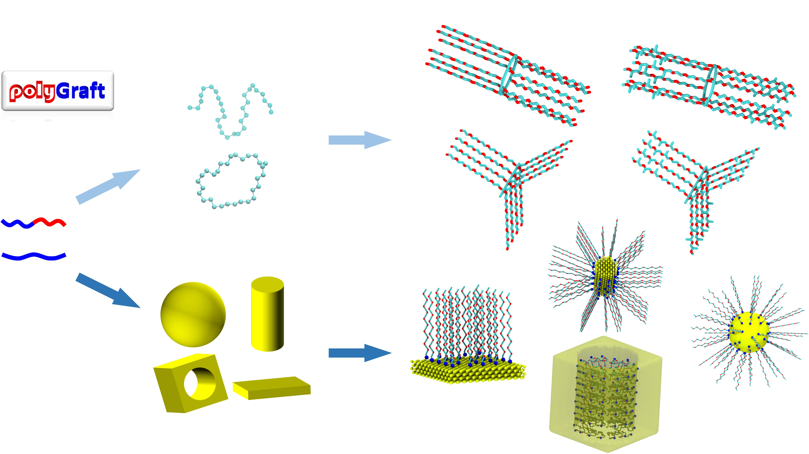

# polyGraft 1.0: a Program for Molecular Structure and Topology Generation of Polymer-Grafted Hybrid Nanostructures



# Requisites
- [atomsk](https://atomsk.univ-lille.fr/)
- [MDAnalysis](https://www.mdanalysis.org/)
- numba

Installation steps:
1. create a python environment adding MDAnalysis, numba etc.
2. download atomsk and place under /path/to/polyGraft/bin
3. use polyGraft for generation under /path/to/polyGraft/examples

NOTE: to use other polymers (rather than PEO) for polymer brush generation using polyGraft, one must provide the .gro and .itp files 

# How to use
Representative examples are given in the **examples** folder. Check it out! For any nanostructure generation, it takes two steps generally:
1. generate the substrate lattice, and import polymer (gro and itp files);
2. generate the structure (gro file) and topology (itp file) using polyGraft.

Using PEO-grafted gold nanoparticle as an example, the code is (MUST use under examples directory):
```python
import sys
sys.path.insert(0,"../polyGraft/")
from polyGraft import polyGraft
from polymer import Polymer
from crystal import Crystal

if __name__ == '__main__':	

	# import peo
	peo = Polymer(poly_name="PEO")

	# read from file
	peo.readGRO("PEO12_line.gro")
	peo.readITP("PEO12.itp")

	# import Au nanoparticle
	radius = 20.0
	nanoparticle = Crystal("nanoparticle", 'Au', radius)
	nanoparticle.readPDB("AuNP-R20.pdb", guessing_bond=True, lattice_const=4.08)

	# graft
	peo_g_np = polyGraft(nanoparticle, peo)

	# set grafting density unit in A^-2
	gft = 0.0250 
	peo_g_np.setGraftingDensity(gft)

	# generate the grafted structure
	peo_g_np.genGraftStruct()

	# save gro and itp
	peo_g_np.toGRO("peo_g_np_gft"+"-R-"+str(radius)+"-sigma-"+str(gft)+".gro")
	peo_g_np.toITP("peo_g_np_gft"+"-R-"+str(radius)+"-sigma-"+str(gft)+".itp")
```

# How to cite
1. Chen, Guang. "polyGraft: a Program for Molecular Structure and Topology Generation of Polymer-Grafted Hybrid Nanostructures". Submitted.
2. Chen, Guang, and Elena E. Dormidontova. "Cyclic vs Linear Bottlebrush Polymers in Solution: Side-Chain Length Effect." Macromolecules 56.9 (2023): 3286–3295. https://doi.org/10.1021/acs.macromol.3c00362
3. Chen, Guang, and Elena Dormidontova. "PEO-Grafted Gold Nanopore: Grafting Density, Chain Length, and Curvature Effects." Macromolecules 55.12 (2022): 5222-5232. https://doi.org/10.1021/acs.macromol.2c00323
