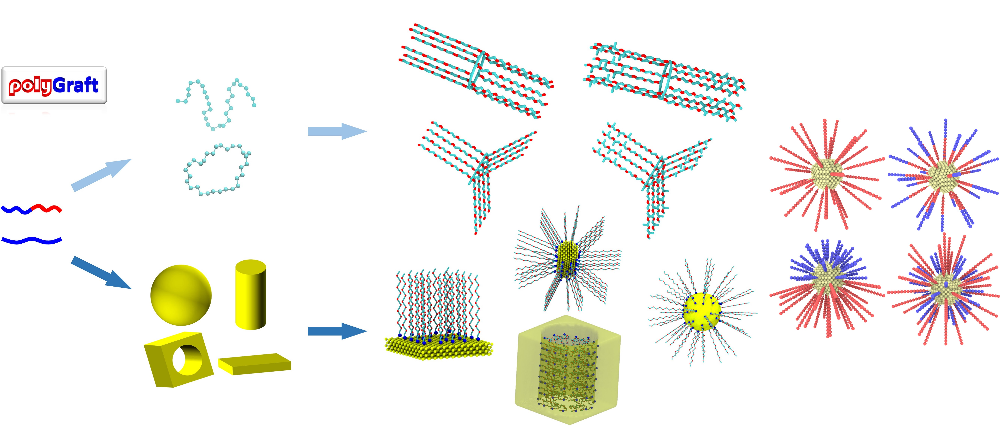

# polyGraft 1.0: a Program for Molecular Structure and Topology Generation of Polymer-Grafted Hybrid Nanostructures

# Requisites
- [atomsk](https://atomsk.univ-lille.fr/)
- [MDAnalysis](https://www.mdanalysis.org/)
- numba

Installation steps:
1. create a python environment adding MDAnalysis
2. download atomsk and place under /path/to/polyGraft/bin
3. use polyGraft for generation under /path/to/polyGraft/examples
4. to use polyGraft for other polymers, one must provide the .gro and .itp files 

# How to cite
1. Chen, Guang. "polyGraft: a Program for Molecular Structure and Topology Generation of Polymer-Grafted Hybrid Nanostructures". Submitted.
2. Chen, Guang, and Elena E. Dormidontova. "Cyclic vs Linear Bottlebrush Polymers in Solution: Side-Chain Length Effect." Macromolecules 56.9 (2023): 3286–3295. https://doi.org/10.1021/acs.macromol.3c00362
3. Chen, Guang, and Elena Dormidontova. "PEO-Grafted Gold Nanopore: Grafting Density, Chain Length, and Curvature Effects." Macromolecules 55.12 (2022): 5222-5232. https://doi.org/10.1021/acs.macromol.2c00323
